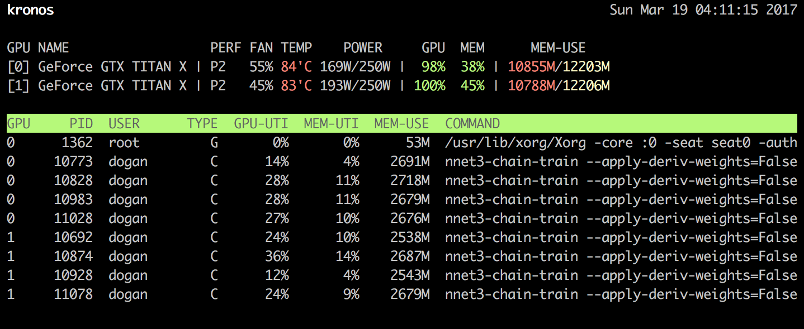

`gtop`
=========

`gtop` is a simple process monitor for NVIDIA GPUs based on a fork of
[`gpustat`](https://pypi.python.org/pypi/gpustat) by
[wookayin](https://github.com/wookayin). It has an old school interface
reminiscent of interactive system monitors like `top` and `htop`.



Usage
-----

`gpustat` prints a snapshot of the current GPU usage.

`$ gpustat`

Options:

* `--color`           : Color output
* `--truncate`        : Truncate output to console width

`gtop` periodically calls `gpustat` and displays its output. It is not an
interactive process monitor. Pressing any key exits `gtop`. By default `gtop`
output is in color and is truncated to console width.

`$ gtop`

Options:

* `--no-color`        : Do not color output
* `--no-truncate`     : Do not truncate output to console width

Installation
------------

Copy `gpustat` and `gtop` to somewhere in `PATH`, e.g. `/usr/local/bin/`.

```
chmod +x gpustat gtop
cp gpustat gtop /usr/local/bin/
```

License
-------

[MIT License](LICENSE)
